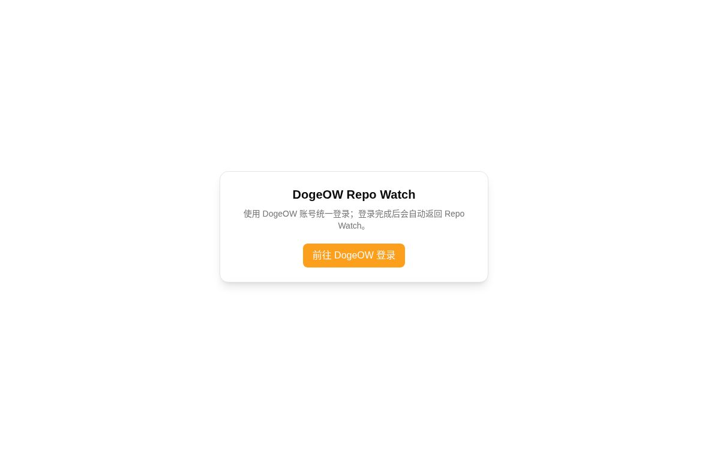

# DogeOW Repo Watch

独立的 GitHub 仓库依赖监控服务：Next.js 前端与 Laravel API 共处一个仓库，使用 DogeOW 一次性 SSO，业务数据存放在独立 `repo_watch` 数据库。

- Web: `web/`
- API: `api/`
- Production: [repo-watch.dogeow.com](https://repo-watch.dogeow.com/)

## 在线体验 / Demo

**[打开 Repo Watch → repo-watch.dogeow.com](https://repo-watch.dogeow.com/)**

线上地址于 **2026-09-30** 核实可打开。这是需要登录的正式应用入口，不是匿名演示沙箱。

1. 打开上方地址，点击「前往 DogeOW 登录」。
2. 使用 DogeOW 账号完成统一登录，随后自动返回 Repo Watch。
3. 登录后的可见仓库和操作范围取决于账号权限；项目没有公布演示账号或密码。

## 截图

### 公开登录入口



2026-09-30 从线上站点实际截取的未登录页面，未使用合成 UI。
这张图展示访问入口，不代表登录后的仓库列表、依赖扫描结果或 OSV 公告界面。
截图来源与后续补图约定见[截图说明](docs/screenshots/README.md)。

## 边界

- 账号与权限由 `next.dogeow.com` 签发的一次性票据提供。
- API 只保存只读身份快照，不连接中央账号数据库。
- `watched_packages` / `watched_repositories` 存在独立 PostgreSQL 数据库 `repo_watch`。
- 前端与 API 通过同域 `/api` 通信，浏览器不跨域共享 Cookie。

## 多仓库监控

面向 20–30 个仓库的依赖快照扫描、变更检测、通知与 OSV 公告，见 [`docs/multi-repo-scaling.md`](docs/multi-repo-scaling.md)。

**上线清单（Sam）**：同一文档的 [Go-live checklist](docs/multi-repo-scaling.md#go-live-checklist-2030-repos) — migrate → cron/worker → token → bulk import → health → notifications → advisories。部署后可跑 `php artisan repo-watch:doctor`。

## 本地开发

```bash
cd api && composer install && php artisan migrate && php artisan serve --port=8012
cd web && npm ci && npm run dev
```

## 首次上线

先将中央 `dogeow-api` 的 Repo Watch SSO 客户端代码部署到正式环境，然后在服务器上按顺序执行：

```bash
sudo scripts/migrate-production-database.sh
sudo scripts/provision-production.sh
```

`provision-production.sh` 会生成独立 SSO 密钥、写入中央 API 的 shared `.env`，安装 nginx / supervisor（API + `repo-watch` queue worker）/ cron（`schedule:run`），清除中央配置缓存并重启 Octane。随后推送或重跑本仓库 `main` 工作流，self-hosted runner 会先部署 API，再部署 Web，并执行健康检查与失败回滚。

首次部署后务必在 `/var/www/repo-watch-api/shared/.env` 填入 `GITHUB_TOKEN`（强烈建议 PAT），按需填 `GITHUB_WEBHOOK_SECRET` 与 `REPO_WATCH_NOTIFY_WEBHOOK_URL`，然后 `php artisan config:cache` 并按 go-live checklist 验收。
